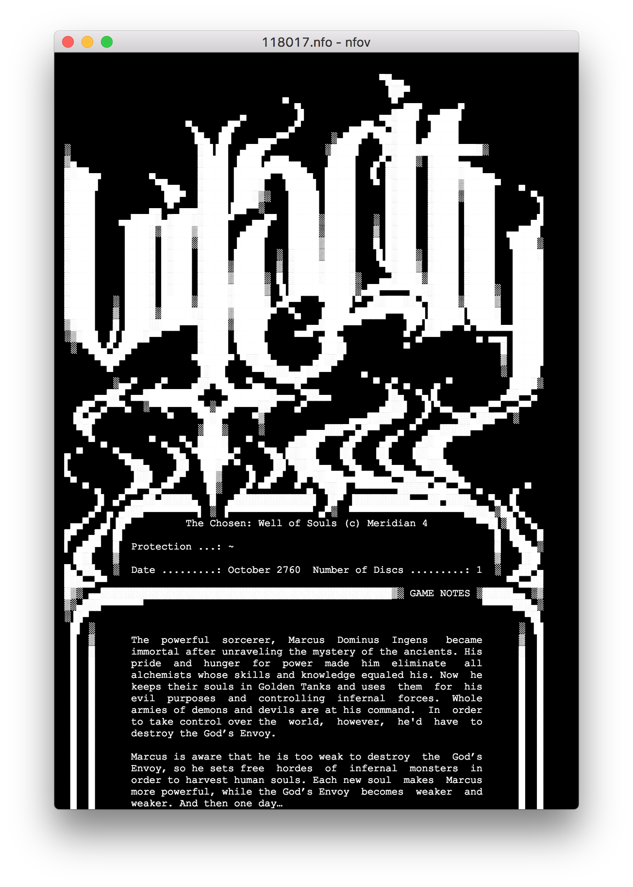
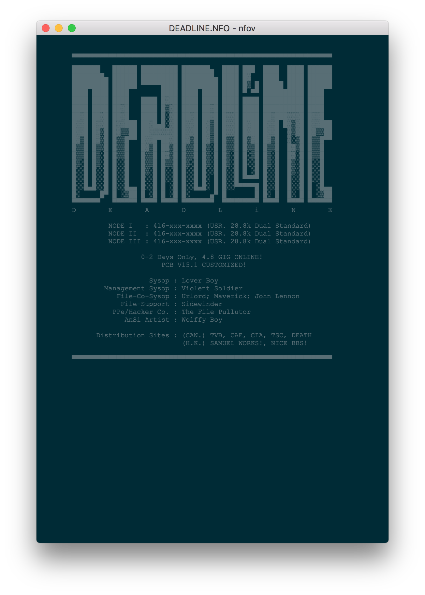

# nfov

nfov is simple ASCII art viewer powered by [Electron](https://electron.atom.io) . Supports nfo/diz. Text and backgroud colors are customizable.

## Installation

Soon. For now can be built from sources:

```sh
npm install
electron-forge make
```

Also this font is needed:

```sh
brew tap caskroom/fonts
brew cask install font-terminus
```

## Screenshots



