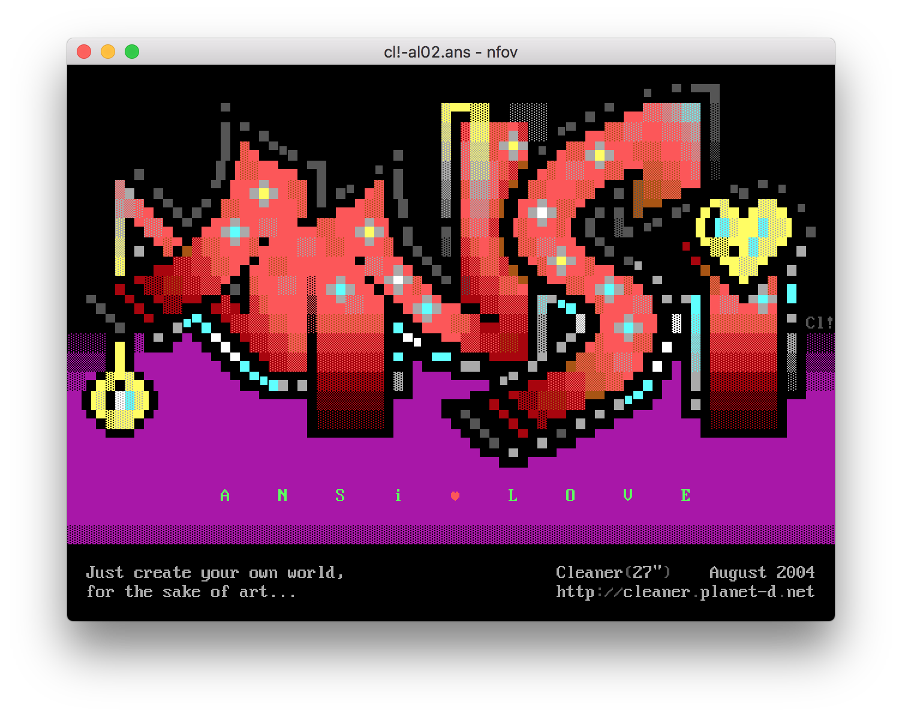

# nfov

[](https://travis-ci.org/nrlquaker/nfov)


nfov is ASCII / ANSI art viewer for macOS powered by [Electron](https://electronjs.org) and [ansilove.js](https://github.com/ansilove/ansilove.js)

## Features

- nfo, diz, asc, txt, ans, cia, ice, xb, pcb, bin, tnd, idf, adf support
- ability to change font, font size, text and background color
- ability to change selection and link color
- ability to toggle font smoothing
- clickable links
- ability to save rendered png

## Fonts

nfov is bundled with:

- a lot of fonts from [The Ultimate Oldschool PC Font Pack](http://int10h.org/oldschool-pc-fonts)
- [BlockZone](https://github.com/ansilove/BlockZone)
- [Profont for Windows tweaked](http://tobiasjung.name/profont)
- [PT Mono](https://fonts.google.com/specimen/PT+Mono)

## Installation

Can be easily installed with [Homebrew Cask](https://caskroom.github.io):

```sh
brew cask install nfov
```

Alternatively, binaries are available in the [GitHub Releases](https://github.com/nrlquaker/nfov/releases)

## Build from source

```sh
git submodule update --init --recursive
npm install
npm run make
```

## Screenshots




## Similar apps

### Editors

- [PabloDraw](http://picoe.ca/products/pablodraw)

### Viewers

- [Ascension](https://github.com/ansilove/Ascension)
- [NFOViewer](http://blockart.sourceforge.net)

### Terminal viewers

- [ansiterm](https://github.com/jcs/ansiterm)
- [termNFO](https://github.com/phracker/termNFO)

### QuickLook plugins

- [QLAnsilove](https://github.com/ansilove/QLAnsilove)
- [QuickNFO](https://github.com/planbnet/QuickNFO)

## License

nfov is released under the [MIT License](https://github.com/nrlquaker/nfov/blob/master/LICENSE)
