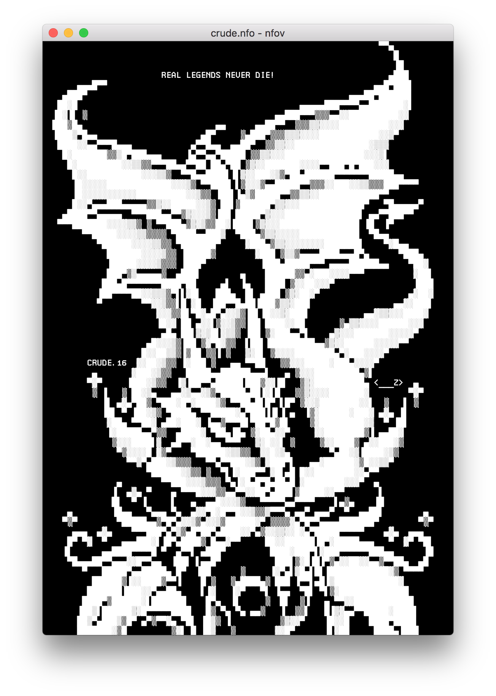

# nfov

nfov is simple ASCII art viewer for macOS powered by [Electron](https://electron.atom.io)

## Features

- nfo, diz, asc support
- ability to change font, font size, text and background color
- ability to change selection and link color
- clickable links
- ability to save rendered png

## Fonts

nfov is bundled with:

- a lot of fonts from [The Ultimate Oldschool PC Font Pack](http://int10h.org/oldschool-pc-fonts)
- [BlockZone](https://github.com/ansilove/BlockZone)
- [Profont for Windows tweaked](http://tobiasjung.name/profont)
- [PT Mono](https://fonts.google.com/specimen/PT+Mono)

## Installation

Can be easily installed with:

```sh
brew cask install nfov
```

## Screenshots




## Similar apps

- [Ascension](https://github.com/ansilove/Ascension)
- [NFOViewer](http://blockart.sourceforge.net)
- [QLAnsilove](https://github.com/ansilove/QLAnsilove)
- [QuickNFO](https://github.com/planbnet/QuickNFO)
- [termNFO](https://github.com/phracker/termNFO)

## License

nfov is released under the [MIT License](https://github.com/nrlquaker/nfov/blob/master/LICENSE)
